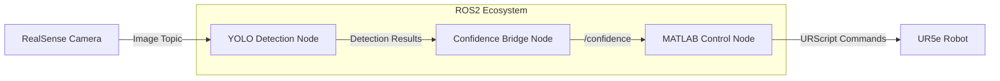

# 🤖 UR5e–YOLO Vision Integration


A real-time vision-guided robotic system integrating:

- **UR5e robotic arm**
- **Intel RealSense camera**
- **YOLO-based object detection**
- **MATLAB control node (ROS 2)**

The system detects objects and dynamically adjusts robot behavior based on detection confidence.

---

## 📌 Features

- 📷 Real-time RGB image streaming (RealSense)
- 🧠 YOLO-based object detection
- 📊 Confidence-driven control logic
- 🤖 ROS 2 → URScript robot control pipeline
- 🔗 Modular ROS 2 node architecture

---

## 🏗️ System Architecture



---

## 🚀 Getting Started

### 🔧 Prerequisites

- ROS 2 (Humble or compatible)
- Intel RealSense SDK
- YOLOv5 ROS package
- MATLAB with ROS Toolbox
- UR5e robot connected to network

---

## ▶️ Launch Instructions

> ⚠️ **Important:** Run the following steps in order.

---

### 1️⃣ Launch RealSense Camera

```bash
ros2 launch realsense2_camera rs_pointcloud_launch.py
```

**Optional (custom resolution):**
```bash
ros2 launch realsense2_camera rs_pointcloud_launch.py rgb_camera.color_profile:=1280x720x6
```

- **Topic:** `/camera/camera/color/image_raw`
- **Description:** Publishes RGB image stream for object detection

---

### 2️⃣ Launch UR5e Driver

```bash
ros2 launch ur_robot_driver ur_control.launch.py ur_type:=ur5e robot_ip:=158.125.191.88
```

- **Network:**
  - University network: `158.125.191.88`
  - Internal robot IP: `10.0.0.100`

- **Description:** Enables ROS 2 communication with the UR5e robot

---

### 3️⃣ Launch YOLO Detection Node

```bash
ros2 run yolov5_ros yolov5_ros --ros-args --remap raw:=/camera/camera/color/image_raw
```

**Alternative:**
```bash
ros2 launch yolov5_ros2 yolov5_ros2
```

- **Description:**
  - Subscribes to camera images
  - Performs object detection
  - Outputs detection results with confidence scores

---

### 4️⃣ Launch Confidence Bridge Node

```bash
ros2 run confid_subpub confid_subpub
```

- **Publishes:** `/confidence`
- **Description:**
  - Extracts confidence from detection results
  - Publishes processed value for control logic

---

### 5️⃣ Launch MATLAB Control Node

```bash
matlab -softwareopengl
```

Run in MATLAB:

```matlab
ur5e_ros2_lookAt_control.m
```

- **Publishes:** `/urscript_interface/script_command`
- **Description:**
  - Subscribes to `/confidence`
  - Computes robot motion
  - Sends URScript commands to UR5e

---

## 🔄 System Pipeline

```
Camera → Detection → Confidence → Control → Robot
```

---

## 🧪 Debugging & Verification

Check active topics:
```bash
ros2 topic list
```

Monitor confidence output:
```bash
ros2 topic echo /confidence
```

Common issues:

- ❌ No detection → Check image topic remapping  
- ❌ Robot not moving → Verify `/urscript_interface/script_command`  
- ❌ No camera feed → Confirm RealSense node is running  

---

## 📁 Project Structure (Suggested)

```
.
├── yolov5_ros/
├── confid_subpub/
├── matlab/
│   └── ur5e_ros2_lookAt_control.m
├── launch/
├── README.md
```

---

## 📈 Future Improvements

- Add depth-based positioning (3D localization)
- Integrate MoveIt for motion planning
- Replace MATLAB with a full ROS 2 control node (Python/C++)
- Add multi-object tracking

---

## 👨‍💻 Author

- MSc Robotics Project – Loughborough University  

---

## 📜 License

Specify your license here (e.g., MIT, Apache 2.0)
